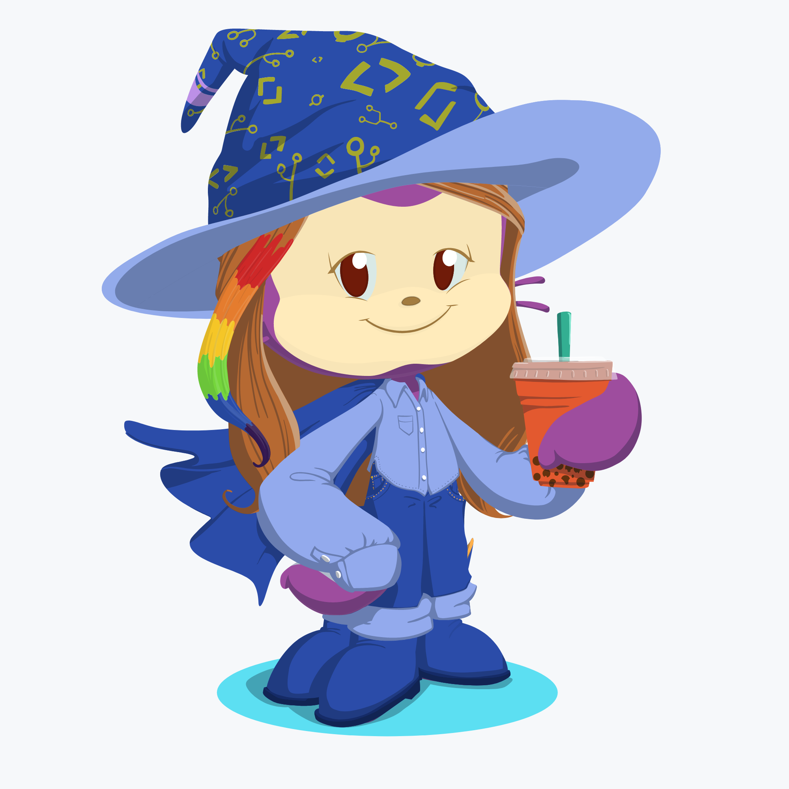

# hello-world
Hi Human!

Though I had another Github account years ago, I didn't get a chance to learn all the features and do tons of programming on it. Now I want to start to ultilize it more!

This repository is (obviously) the practice from the GitHub official get-started guide. I will use this page to input and store some ideas later here.

There are several projects I have in plan:

- Build a personal website / website for fun to track my studying process for: Guitar, Karate, Japanese, CS languages

- Practice LeetCode questions, refresh myself with computer science knowledge, learn new algorithms and techniques, and become a better computer scientist (seems like there are a lot of resources on GitHub!)

- Try some algorithm trading (also a lot of resources on GitHub!)

- Build a (partial) private database to store and re-arrange words, articles and random thoughts I posted in past few years in different social network platforms and blogs

#### 2019/8/16: Celebrating One Month On GitHub!

Created this Octocat from official celebration email - 

